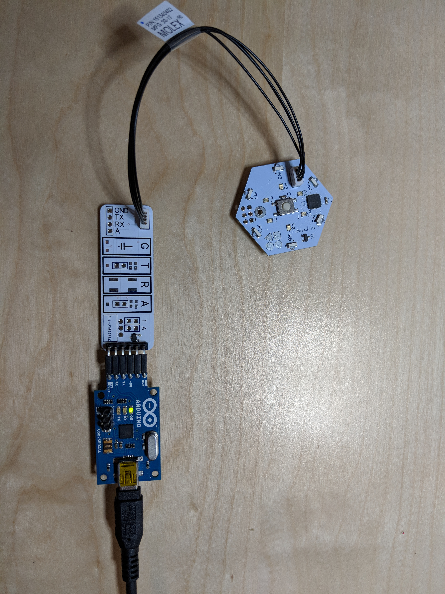
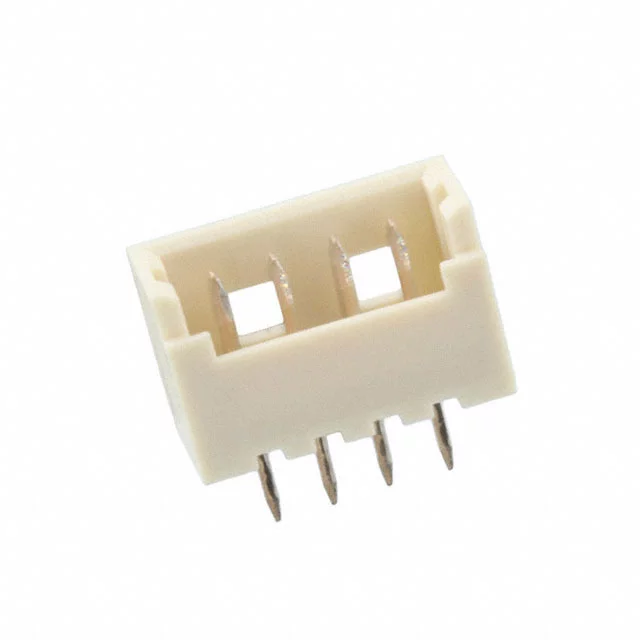
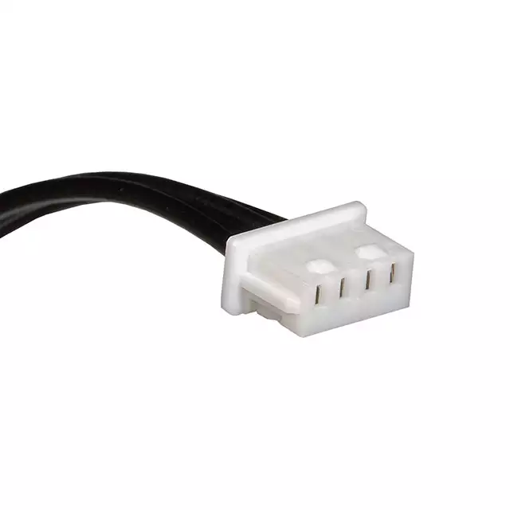

## Blinks Serial Port Adapter Board	
This little board can be helpful when developing software to run on the blinks game tile platform. It gives you a serial connection that you can connect to with a terminal program (like the Arduino built-in serial monitor) so you can interact textually with your blinks programs. Very handy for debugging.    

For more information, see the `cores/sp.h` header in the `blinks-arduino-platform` repo.

It features:

### Minimal serial port usage

To use as a serial adapter, you only need to populate the JST connector, the 6 pin header, and the P-Chan MOSFET...

(placeholder image of old board, new photo of new one!)

The connectors shown are these...

[WM1733-ND](https://www.digikey.com/product-detail/en/molex-llc/0530470410/WM1733-ND/242855)

Cable shown is this...

[WM15257-ND](https://www.digikey.com/product-detail/en/molex-llc/0151340401/WM15257-ND/6198147)

...although several lengths are available....

https://www.digikey.com/products/en/cable-assemblies/rectangular-cable-assemblies/450?k=&pkeyword=&pv88=6&FV=ffecefb1&quantity=0&ColumnSort=0&page=1&pageSize=25

The transistor on the board is this....

[AO3415A](https://www.digikey.com/product-detail/en/alpha-omega-semiconductor-inc/AO3415A/785-1193-1-ND/2353911)

...although almost any P-CHAN MOSFET with the right pinout should work. 

### Theory of operation

We can not directly connect the TX from the USB serial board to the RX on the tile because then we might damage the battery if current flowed into the tile though the protect diode on the RX pin.

We can not use a simple level converter because we do not have the blinks positive voltage supply available on the serial port pins.

To get around this, we use a trick. We enable the [pull-up resistor on the RX pin](https://electronics.stackexchange.com/questions/339709/does-enabling-the-alternate-rxd-function-on-an-avr-gpio-pin-disable-the-pull-up) on the tile, and then use a P-CHAN transistor to pull-down this pull-up anytime the USB TX goes low. 

 