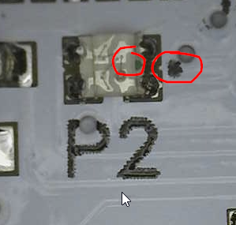
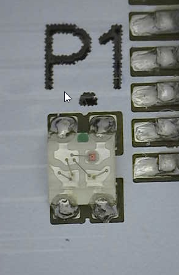
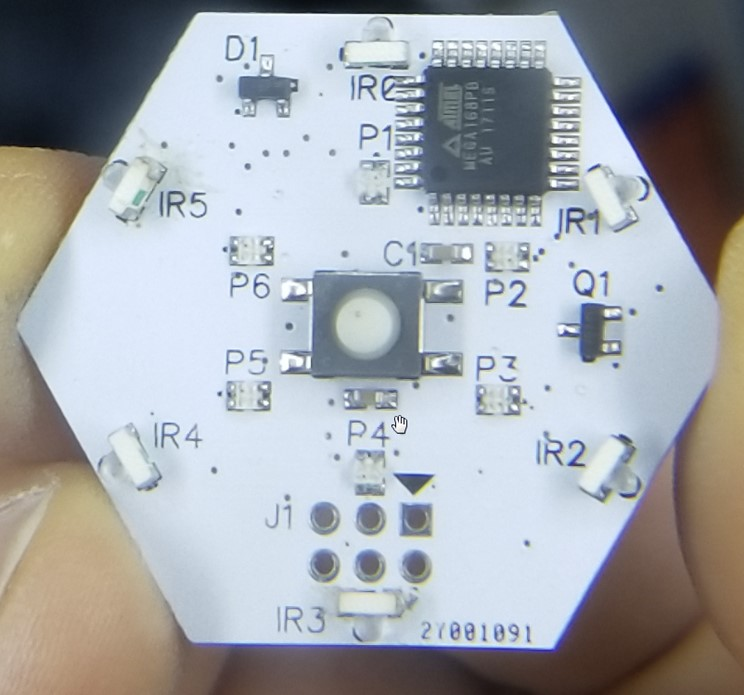

### Tile Assembly Notes

## 0606 RGB LED

The green dot on the LED face always aligns with the dot on the silk. All green dots on RGB LEDs point towards outside edge of PCB.

## IR LED

IR LEDs are side facing. They always point with lens towards PCB edge

Each IR LED has a green stripe on the back which aligns to the line on the silk

### Completed PCB

