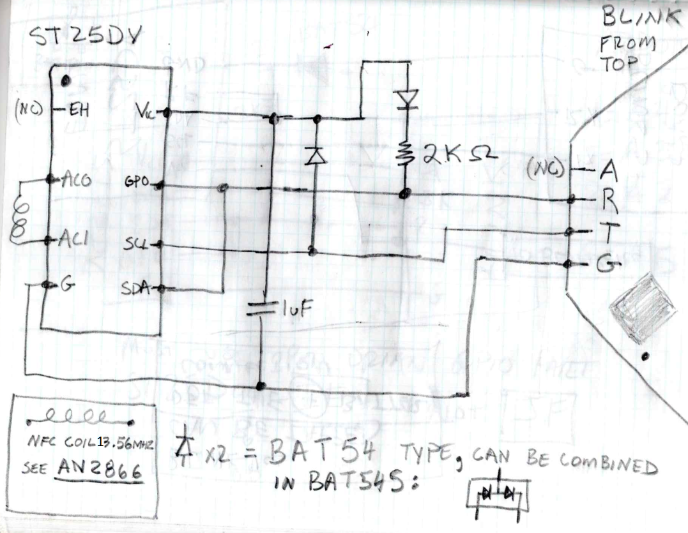

# Blinks NFC daughterboard

This is a daughterboard that adds NFC download capability to an existing 328PB-based blink. It connects to the SP connector. This daughterboard also requires the NFC firmware. You can not use the SP port on a blink that has the NFC firmware.

## STD25DV

This chip from ST handles the NFC details and presents an i2c interface to the blink.

The chip comes in several memory sizes, but we do not use the memory so you can use any size.   

This design depends on the GPO pin being open-collector so you can only use parts that end in `IE` and not the ones that end in `JF` which are CMOS push-pull. 

Current suitable part numbers:
ST25DV04K-IE
ST25DV16K-IE
ST25DV64K-IE

You can use any package size.

### NFC coil

You need a 13.56Mhz coil connected to the ST25DV.

For development, you can get an ANT-7-T-ST25DV04K eval board that has a built in antenna. 

Otherwise see [AN2866](https://www.st.com/resource/en/application_note/an2866-how-to-design-a-1356-mhz-customized-antenna-for-st25-nfc--rfid-tags-stmicroelectronics.pdf) for coil design information. 

## Schematic

Note this shows a recent Jetta-version of the blink PCB. Older PCBs would have the `R` and `T` pins swapped relative to this.   

## Theory of operation

The `T` pin is used as (1) a weakly pulled-up interrupt line from the ST25 to the blink to wake it on initial NFC contact and each time an NFC massages it received, and (2) as the strongly pulled-up SDA line during i2c communications. 

The `C` pin is used as (1) a driven power supply to the `Vcc` of the ST25, and (2) the driven SCL for i2c communications.   

In the idle state, `T` is low and and `R` is weakly pulled high by an internal ~50K ohm pull-up. In this state the ST25 is not powered so no battery drain. 

The ST25 is programmed so that the GPO line can be pulled down via a command on the NFC interface. The app sends this command, which pulses `R` low. This causes an interrupt on the blink that wakes it if it is sleeping and then enters the NFC download mode. 

The blink then drives `T` high which powers up the ST25. The ST25 must be powered via the `Vcc` pin before the mailbox function can be enabled, so the blink waits for the ST25 to power up and for the 1uF capacitor to charge up. That capacitor will keep the ST25 powered even when the `T` line briefly goes low when it is clocking bits on the i2c interface. The 2k Ohm resistor provides a stronger pull-up for the SDA line while the ST25 is powered so that i2c can run faster. 

### Diodes 

The diode on the `R` prevents the ST25 from being powered by the weak pull-up on `R` during idle. This would quickly drain the battery. 

The diode on the `T` keeps the capacitor charged while the SCL line briefly goes low while clocking i2c bits. This keeps the ST25 continuously powered. When all NFC stuff is done, then the `T` goes low for a long time, which powers down the ST25.   
 
The two diode should be schotkey type and can be combined into a single package like BAT54S to save space.    

### Prototype

You can turn a existing blink into an NFC blink using an ST25DV eval board like this...

[NFC Prototype Images](prototype)
