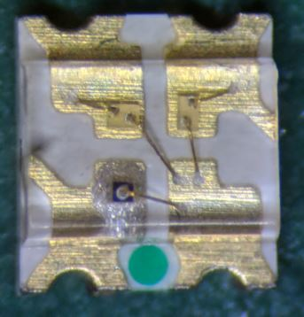
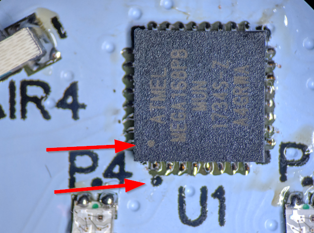

### Tile Assembly Notes

# Parts check

## 0606 RGB LEDs P0-P5

Visually confirm that the `19-237A/BHR6GHC-A01/2T` RGB LEDs look like one of these...

NOTE: The appearance of this part does not match the photo on the datsheet!

# Orientation

## 0606 RGB LEDs P0-P5

The green dot on the RGB LED face aligns with the dot on the silk. All green dots on RGB LEDs point towards outside edge of PCB.

## IR LED IR0-IR5

IR LEDs are side facing. They always point with lens towards PCB edge.

Green square on IR LED aligns to square on silk. All squares should be pointing in counter-clockwise direction

## U1

U1 IC marking dot aligns to dot on silk.

## D1 

It is only possible to install diode D1 one way on footprint. 

## Other parts

Parts S1, C1, C2 can be installed in either orientation.

 